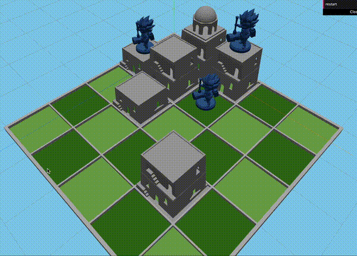

# 🏛️ Santorini Online

> [!IMPORTANT]
> After taking a **Graphical Computation** course and developing a growing interest in board games, I came across an online version of the game **Santorini**. However, I found that the website didn’t enforce the game’s rules—pieces were free to move anywhere on the board, which detracted from the strategy and experience. This frustration, combined with an inevitable childhood desire to develop games, sparked an idea: I decided it would be a fun and fulfilling challenge to create my own online version of **Santorini**, one that fully enforces the game rules and provides an enjoyable and seamless experience for players.

## 🚀 About the Project

**Santorini Online** is a web-based version of the popular board game **Santorini**. This project brings the gameplay experience online, allowing users to compete against friends or AI, with full rule enforcement and game persistency. It’s designed to capture the strategy of the original board game while ensuring a seamless experience in the digital world.



> [!WARNING]
> Unfortunately, due to a recent rework of the frontend and 3D rendering engine, the connection between the frontend and backend components is currently being redeveloped. As a result, there is no up-to-date video that showcases the current state of the project.
>
> The previous video shown above demonstrates an earlier version of the frontend, as the frontend governance was removed to support planned future features like ranking and competition.

## 📅 Roadmap (MVP)

- [x] User authentication and authorization
- [ ] Implement game persistency (database integration to save)
- [ ] Define and implement frontend graphical interface
  - Translate game state changes to 3D graphics
- [ ] Ensure full rule enforcement and game logic

## 🛠️ Technologies Used

Here are the key technologies and libraries used in this project:

<p align="center">
  <a href="https://nodejs.org/" target="_blank" rel="noopener noreferrer">
    
  </a>
  <a href="https://expressjs.com/" target="_blank" rel="noopener noreferrer">
    
  </a>
  <a href="https://kysely.dev/" target="_blank" rel="noopener noreferrer">
    
  </a>
  <a href="http://www.passportjs.org/" target="_blank" rel="noopener noreferrer">
    
  </a>
  <a href="https://threejs.org/" target="_blank" rel="noopener noreferrer">
    
  </a>
  <a href="https://www.typescriptlang.org/" target="_blank" rel="noopener noreferrer">
    
  </a>
</p>

## 🤝 Contributing

This is a personal portfolio project, and I'm the primary contributor. However, if you'd like to contribute, feel free to:

1. **Open an Issue**: If you find a bug or have a suggestion, please open an issue to discuss it.
2. **Submit a Pull Request**: Fork the repository, make your changes in a new branch, and submit a pull request for review.

### Steps for Pull Requests

1. Fork the repository.
2. Create a new branch for your feature:
3. Chommit your changes:

   ```bash
   git commit -m 'feat: add YourFeatureName'
   ```

4. Push to your branch:

   ```bash
   git push origin feature/YourFeatureName
   ```

5. Open a pull request and explain your changes.

## 📖 How to Play

In **Santorini**, the goal is to be the first player to move one of your workers onto the third level of a building. Players take turns moving one worker and building a block or dome.

### Basic Rules

1. **Move**: Move one of your workers to an adjacent space.
2. **Build**: After moving, build a block or dome in an adjacent space.
3. **Win**: If you can move one of your workers to the third level of a building, you win!

For a more detailed explanation of the rules, check out the [official Santorini rules](https://roxley.com/santorini).

## 📝 License

This project is licensed under the **AGPL-3.0 License**. See the [LICENSE](./LICENSE) file for more details.

## 📦 Installation

```bash
git clone https://github.com/neves-nvs/santorini.git
```

### Backend

1. Navigate to the backend directory:

   ```bash
   cd packages/server
   ```

2. Install the dependencies:

   ```bash
   npm install
   ```

3. Start the backend server:

   ```bash
   npm run dev
   ```

### Frontend

1. Navigate to the frontend directory:

   ```bash
   cd packages/client
   ```

2. Install the dependencies:

   ```bash
   npm install
   ```

3. Run the frontend:

```bash
npm run dev
```

4 Open your browser and go to <http://localhost:5173> to view the application.

## Acknowledgements

- Thanks to the creators of the original **Santorini** board game.
- The 3D models for the game pieces are not mine. **TODO: Credit the models designers**.
